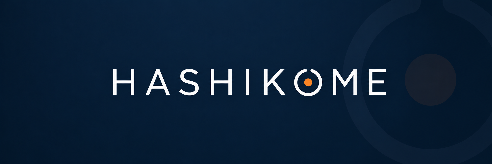

<p align="center">
  
</p>

<p align="center">
  <strong>SOFTWARE PRODUCTS THAT CONNECT AND EMPOWER.</strong>
</p>

---

HASHIKOME is a software company focused on building practical software products. We think product-first, with SaaS as the main direction, and we use focused contract work to build strong custom systems for teams, institutions, and companies when the problem is worth solving.

Our work is guided by clarity, reliability, interoperability, and sustainability. We aim to solve the real problem directly, support daily operational use, help systems communicate cleanly, and build software that can be maintained, improved, and owned over time.

`profile:`

```yaml
name: HASHIKOME
located_in: Tanzania
work: SaaS products, custom software systems, integrations, and data workflows
mission: Connect and empower people through maintainable software products
```

<!-- Future: add a products section here when HASHIKOME is ready to showcase active SaaS products. Keep the profile lean until then. -->

`connect:`

**Email:** [hello@hashikome.com](mailto:hello@hashikome.com)
